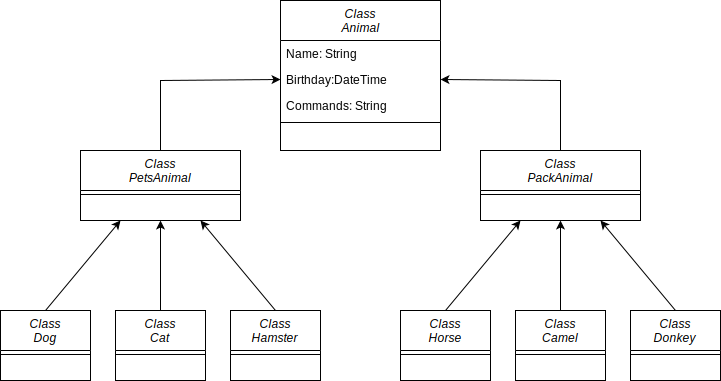

# Итоговая контрольная работа по блоку специализация

## Урок 2. Практическое задание

### Задание для работы можно посмотреть [тут](itog_attest.pdf)

---

#### Задание 1:
Используя команду cat в терминале операционной системы Linux, создать
два файла Домашние животные (заполнив файл собаками, кошками,
хомяками) и Вьючные животными заполнив файл Лошадьми, верблюдами и
ослы), а затем объединить их. Просмотреть содержимое созданного файла.
Переименовать файл, дав ему новое имя (Друзья человека).

#### Решение:

    cat > pets.txt
    dog
    cat
    hamster
    
    cat > pack.txt
    horse
    camel
    donkey
    
    cat pets.txt pack.txt > human_friends.txt
    cat human_friends.txt
    dog
    cat
    hamster
    horse
    camel
    donkey

#### Задание 2: Создать директорию, переместить файл туда.

#### Решение:

    mkdir work
    mv ./human_friends.txt ./work/

#### Задание 3: Подключить дополнительный репозиторий MySQL. Установить любой пакет из этого репозитория.

#### Решение:

Устанавливаем MySQl. 

Устанавливаем репозитарий

    wget -c https://dev.mysql.com/get/mysql-apt-config_0.8.24-1_all.deb
    sudo dpkg -i mysql-apt-config_0.8.24-1_all.deb

Обновим базу пакетов, чтобы в ней появились пакеты из нового источника:

    sudo apt update

Убедимся, что MySQL будет устанавиливаться именно из репозитария MySQL, а не из репозитария Ubuntu:

    apt-cache policy mysql-server

Устанавливам MySQL:

    sudo apt install mysql-server

Проверяем запущен ли процесс демона docker, и активирован ли у него автозапуск при загрузке системы:

    sudo systemctl status mysql

#### Задание 4: Установить и удалить deb-пакет с помощью dpkg.

#### Решение:

Будем устанавливать Zoom

Скачиваем deb пакет:

    wget https://zoom.us/client/5.13.5.431/zoom_amd64.deb

Устанавливаем его:

    sudo dpkg -i zoom_amd64.deb

Получаем ошибки о том, что не хватает некоторых пакетов. Добавляем их:

    sudo apt install mailcap gnome-menus desktop-file-utils shared-mime-info

Устраняем проблемы с зависимостями пакетов:

    sudo apt --fix-broken install

Программа установлена.

Удаляем zoom с нашего компьютера:

    sudo dpkg -P zoom

#### Задание 5: Выложить историю команд в терминале ubuntu

#### Решение:
    user@server:~$ cat > pets.txt
    dog
    cat
    hamster
    user@server:~$ cat > pack.txt
    horse
    camel
    donkey
    user@server:~$ cat pets.txt pack.txt > human_friends.txt
    user@server:~$ cat human_friends.txt
    dog
    cat
    hamster
    horse
    camel
    donkey
    user@server:~$
    user@server:~$ mkdir work
    user@server:~$ mv ./human_friends.txt ./work/
    user@server:~$ wget -c https://dev.mysql.com/get/mysql-apt-config_0.8.24-1_all.deb
    --2023-04-18 10:24:24--  https://dev.mysql.com/get/mysql-apt-config_0.8.24-1_all.deb
    Распознаётся dev.mysql.com (dev.mysql.com)… 184.85.150.139, 2001:2030:21:19e::2e31, 2001:2030:21:1a9::2e31
    Подключение к dev.mysql.com (dev.mysql.com)|184.85.150.139|:443... соединение установлено.
    HTTP-запрос отправлен. Ожидание ответа… 302 Moved Temporarily
    Адрес: https://repo.mysql.com//mysql-apt-config_0.8.24-1_all.deb [переход]
    --2023-04-18 10:24:24--  https://repo.mysql.com//mysql-apt-config_0.8.24-1_all.deb
    Распознаётся repo.mysql.com (repo.mysql.com)… 2.18.33.182
    Подключение к repo.mysql.com (repo.mysql.com)|2.18.33.182|:443... соединение установлено.
    HTTP-запрос отправлен. Ожидание ответа… 200 OK
    Длина: 18048 (18K) [application/x-debian-package]
    Сохранение в: ‘mysql-apt-config_0.8.24-1_all.deb’
    
    mysql-apt-config_0.8.24-1_all 100%[==============================================>]  17,62K  --.-KB/s    за 0s
    
    2023-04-18 10:24:25 (230 MB/s) - ‘mysql-apt-config_0.8.24-1_all.deb’ сохранён [18048/18048]
    
    user@server:~$ sudo dpkg -i mysql-apt-config_0.8.24-1_all.deb
    Выбор ранее не выбранного пакета mysql-apt-config.
    (Чтение базы данных … на данный момент установлено 185326 файлов и каталогов.)
    Подготовка к распаковке mysql-apt-config_0.8.24-1_all.deb …
    Распаковывается mysql-apt-config (0.8.24-1) …
    Настраивается пакет mysql-apt-config (0.8.24-1) …
    Warning: apt-key should not be used in scripts (called from postinst maintainerscript of the package mysql-apt-config)
    Warning: apt-key is deprecated. Manage keyring files in trusted.gpg.d instead (see apt-key(8)).
    OK
    user@server:~$
    user@server:~$ sudo apt update
    Пол:1 http://security.ubuntu.com/ubuntu jammy-security InRelease [110 kB]
    Сущ:2 http://ru.archive.ubuntu.com/ubuntu jammy InRelease
    Сущ:3 https://ppa.launchpadcontent.net/mozillateam/ppa/ubuntu jammy InRelease
    Пол:4 http://ru.archive.ubuntu.com/ubuntu jammy-updates InRelease [119 kB]
    Сущ:5 https://download.docker.com/linux/ubuntu focal InRelease
    Пол:6 http://ru.archive.ubuntu.com/ubuntu jammy-backports InRelease [108 kB]
    Пол:7 http://repo.mysql.com/apt/ubuntu jammy InRelease [15,2 kB]
    Пол:8 http://repo.mysql.com/apt/ubuntu jammy/mysql-8.0 Sources [964 B]
    Пол:9 http://repo.mysql.com/apt/ubuntu jammy/mysql-apt-config amd64 Packages [565 B]
    Пол:10 http://repo.mysql.com/apt/ubuntu jammy/mysql-apt-config i386 Packages [565 B]
    Пол:11 http://repo.mysql.com/apt/ubuntu jammy/mysql-8.0 amd64 Packages [8 615 B]
    Пол:12 http://repo.mysql.com/apt/ubuntu jammy/mysql-tools i386 Packages [457 B]
    Пол:13 http://repo.mysql.com/apt/ubuntu jammy/mysql-tools amd64 Packages [7 997 B]
    Получено 371 kB за 1с (294 kB/s)
    Чтение списков пакетов… Готово
    Построение дерева зависимостей… Готово
    Чтение информации о состоянии… Готово
    user@server:~$
    user@server:~$ apt-cache policy mysql-server
    mysql-server:
      Установлен: 8.0.33-1ubuntu22.04
      Кандидат:   8.0.33-1ubuntu22.04
      Таблица версий:
     *** 8.0.33-1ubuntu22.04 500
            500 http://repo.mysql.com/apt/ubuntu jammy/mysql-8.0 amd64 Packages
            100 /var/lib/dpkg/status
         8.0.32-0ubuntu0.22.04.2 500
            500 http://ru.archive.ubuntu.com/ubuntu jammy-updates/main amd64 Packages
            500 http://ru.archive.ubuntu.com/ubuntu jammy-updates/main i386 Packages
            500 http://security.ubuntu.com/ubuntu jammy-security/main amd64 Packages
            500 http://security.ubuntu.com/ubuntu jammy-security/main i386 Packages
         8.0.32-0buntu0.22.04.1 500
            500 http://ru.archive.ubuntu.com/ubuntu jammy-updates/main amd64 Packages
            500 http://ru.archive.ubuntu.com/ubuntu jammy-updates/main i386 Packages
         8.0.28-0ubuntu4 500
            500 http://ru.archive.ubuntu.com/ubuntu jammy/main amd64 Packages
            500 http://ru.archive.ubuntu.com/ubuntu jammy/main i386 Packages
    user@server:~$
    user@server:~$ sudo apt install mysql-server
    Чтение списков пакетов… Готово
    Построение дерева зависимостей… Готово
    Чтение информации о состоянии… Готово
    Следующие пакеты устанавливались автоматически и больше не требуются:
      libegl1-mesa libflashrom1 libftdi1-2 libgl1-mesa-glx libxcb-xinerama0 libxcb-xtest0
    Для их удаления используйте «sudo apt autoremove».
    Будут установлены следующие дополнительные пакеты:
      libmecab2 mecab-ipadic mecab-ipadic-utf8 mecab-utils mysql-client mysql-common mysql-community-client
      mysql-community-client-core mysql-community-client-plugins mysql-community-server mysql-community-server-core
    Следующие НОВЫЕ пакеты будут установлены:
      libmecab2 mecab-ipadic mecab-ipadic-utf8 mecab-utils mysql-client mysql-common mysql-community-client
      mysql-community-client-core mysql-community-client-plugins mysql-community-server mysql-community-server-core
      mysql-server
    Обновлено 0 пакетов, установлено 12 новых пакетов, для удаления отмечено 0 пакетов, и 184 пакетов не обновлено.
    Необходимо скачать 38,1 MB архивов.
    После данной операции объём занятого дискового пространства возрастёт на 273 MB.
    Хотите продолжить? [Д/н] y
    Пол:1 http://ru.archive.ubuntu.com/ubuntu jammy/main amd64 libmecab2 amd64 0.996-14build9 [199 kB]
    Пол:2 http://repo.mysql.com/apt/ubuntu jammy/mysql-8.0 amd64 mysql-common amd64 8.0.33-1ubuntu22.04 [68,9 kB]
    Пол:3 http://ru.archive.ubuntu.com/ubuntu jammy/main amd64 mecab-utils amd64 0.996-14build9 [4 850 B]
    Пол:4 http://ru.archive.ubuntu.com/ubuntu jammy/main amd64 mecab-ipadic all 2.7.0-20070801+main-3 [6 718 kB]
    Пол:5 http://repo.mysql.com/apt/ubuntu jammy/mysql-8.0 amd64 mysql-community-client-plugins amd64 8.0.33-1ubuntu22.04 [1 436 kB]
    Пол:6 http://repo.mysql.com/apt/ubuntu jammy/mysql-8.0 amd64 mysql-community-client-core amd64 8.0.33-1ubuntu22.04 [2 161 kB]
    Пол:7 http://repo.mysql.com/apt/ubuntu jammy/mysql-8.0 amd64 mysql-community-client amd64 8.0.33-1ubuntu22.04 [2 281 kB]
    Пол:8 http://repo.mysql.com/apt/ubuntu jammy/mysql-8.0 amd64 mysql-client amd64 8.0.33-1ubuntu22.04 [67,6 kB]
    Пол:9 http://repo.mysql.com/apt/ubuntu jammy/mysql-8.0 amd64 mysql-community-server-core amd64 8.0.33-1ubuntu22.04 [25,0 MB]
    Пол:10 http://repo.mysql.com/apt/ubuntu jammy/mysql-8.0 amd64 mysql-community-server amd64 8.0.33-1ubuntu22.04 [79,4 kB]
    Пол:11 http://repo.mysql.com/apt/ubuntu jammy/mysql-8.0 amd64 mysql-server amd64 8.0.33-1ubuntu22.04 [67,6 kB]
    Пол:12 http://ru.archive.ubuntu.com/ubuntu jammy/main amd64 mecab-ipadic-utf8 all 2.7.0-20070801+main-3 [4 384 B]
    Получено 38,1 MB за 6с (6 891 kB/s)
    Предварительная настройка пакетов …
    Выбор ранее не выбранного пакета mysql-common.
    (Чтение базы данных … на данный момент установлен 185331 файл и каталог.)
    Подготовка к распаковке …/00-mysql-common_8.0.33-1ubuntu22.04_amd64.deb …
    Распаковывается mysql-common (8.0.33-1ubuntu22.04) …
    Выбор ранее не выбранного пакета mysql-community-client-plugins.
    Подготовка к распаковке …/01-mysql-community-client-plugins_8.0.33-1ubuntu22.04_amd64.deb …
    Распаковывается mysql-community-client-plugins (8.0.33-1ubuntu22.04) …
    Выбор ранее не выбранного пакета mysql-community-client-core.
    Подготовка к распаковке …/02-mysql-community-client-core_8.0.33-1ubuntu22.04_amd64.deb …
    Распаковывается mysql-community-client-core (8.0.33-1ubuntu22.04) …
    Выбор ранее не выбранного пакета mysql-community-client.
    Подготовка к распаковке …/03-mysql-community-client_8.0.33-1ubuntu22.04_amd64.deb …
    Распаковывается mysql-community-client (8.0.33-1ubuntu22.04) …
    Выбор ранее не выбранного пакета mysql-client.
    Подготовка к распаковке …/04-mysql-client_8.0.33-1ubuntu22.04_amd64.deb …
    Распаковывается mysql-client (8.0.33-1ubuntu22.04) …
    Выбор ранее не выбранного пакета libmecab2:amd64.
    Подготовка к распаковке …/05-libmecab2_0.996-14build9_amd64.deb …
    Распаковывается libmecab2:amd64 (0.996-14build9) …
    Выбор ранее не выбранного пакета mysql-community-server-core.
    Подготовка к распаковке …/06-mysql-community-server-core_8.0.33-1ubuntu22.04_amd64.deb …
    Распаковывается mysql-community-server-core (8.0.33-1ubuntu22.04) …
    Выбор ранее не выбранного пакета mysql-community-server.
    Подготовка к распаковке …/07-mysql-community-server_8.0.33-1ubuntu22.04_amd64.deb …
    Распаковывается mysql-community-server (8.0.33-1ubuntu22.04) …
    Выбор ранее не выбранного пакета mecab-utils.
    Подготовка к распаковке …/08-mecab-utils_0.996-14build9_amd64.deb …
    Распаковывается mecab-utils (0.996-14build9) …
    Выбор ранее не выбранного пакета mecab-ipadic.
    Подготовка к распаковке …/09-mecab-ipadic_2.7.0-20070801+main-3_all.deb …
    Распаковывается mecab-ipadic (2.7.0-20070801+main-3) …
    Выбор ранее не выбранного пакета mecab-ipadic-utf8.
    Подготовка к распаковке …/10-mecab-ipadic-utf8_2.7.0-20070801+main-3_all.deb …
    Распаковывается mecab-ipadic-utf8 (2.7.0-20070801+main-3) …
    Выбор ранее не выбранного пакета mysql-server.
    Подготовка к распаковке …/11-mysql-server_8.0.33-1ubuntu22.04_amd64.deb …
    Распаковывается mysql-server (8.0.33-1ubuntu22.04) …
    Настраивается пакет libmecab2:amd64 (0.996-14build9) …
    Настраивается пакет mysql-common (8.0.33-1ubuntu22.04) …
    update-alternatives: используется /etc/mysql/my.cnf.fallback для предоставления /etc/mysql/my.cnf (my.cnf) в автоматическом режиме
    Настраивается пакет mysql-community-server-core (8.0.33-1ubuntu22.04) …
    Настраивается пакет mecab-utils (0.996-14build9) …
    Настраивается пакет mysql-community-client-plugins (8.0.33-1ubuntu22.04) …
    Настраивается пакет mecab-ipadic (2.7.0-20070801+main-3) …
    Compiling IPA dictionary for Mecab.  This takes long time...
    reading /usr/share/mecab/dic/ipadic/unk.def ... 40
    emitting double-array: 100% |###########################################|
    /usr/share/mecab/dic/ipadic/model.def is not found. skipped.
    reading /usr/share/mecab/dic/ipadic/Symbol.csv ... 208
    reading /usr/share/mecab/dic/ipadic/Noun.number.csv ... 42
    reading /usr/share/mecab/dic/ipadic/Filler.csv ... 19
    reading /usr/share/mecab/dic/ipadic/Postp-col.csv ... 91
    reading /usr/share/mecab/dic/ipadic/Noun.verbal.csv ... 12146
    reading /usr/share/mecab/dic/ipadic/Interjection.csv ... 252
    reading /usr/share/mecab/dic/ipadic/Verb.csv ... 130750
    reading /usr/share/mecab/dic/ipadic/Noun.adverbal.csv ... 795
    reading /usr/share/mecab/dic/ipadic/Noun.place.csv ... 72999
    reading /usr/share/mecab/dic/ipadic/Suffix.csv ... 1393
    reading /usr/share/mecab/dic/ipadic/Auxil.csv ... 199
    reading /usr/share/mecab/dic/ipadic/Prefix.csv ... 221
    reading /usr/share/mecab/dic/ipadic/Postp.csv ... 146
    reading /usr/share/mecab/dic/ipadic/Noun.demonst.csv ... 120
    reading /usr/share/mecab/dic/ipadic/Noun.others.csv ... 151
    reading /usr/share/mecab/dic/ipadic/Noun.csv ... 60477
    reading /usr/share/mecab/dic/ipadic/Noun.nai.csv ... 42
    reading /usr/share/mecab/dic/ipadic/Noun.org.csv ... 16668
    reading /usr/share/mecab/dic/ipadic/Noun.proper.csv ... 27328
    reading /usr/share/mecab/dic/ipadic/Noun.adjv.csv ... 3328
    reading /usr/share/mecab/dic/ipadic/Noun.name.csv ... 34202
    reading /usr/share/mecab/dic/ipadic/Adj.csv ... 27210
    reading /usr/share/mecab/dic/ipadic/Others.csv ... 2
    reading /usr/share/mecab/dic/ipadic/Adverb.csv ... 3032
    reading /usr/share/mecab/dic/ipadic/Adnominal.csv ... 135
    reading /usr/share/mecab/dic/ipadic/Conjunction.csv ... 171
    emitting double-array: 100% |###########################################|
    reading /usr/share/mecab/dic/ipadic/matrix.def ... 1316x1316
    emitting matrix      : 100% |###########################################|
    
    done!
    update-alternatives: используется /var/lib/mecab/dic/ipadic для предоставления /var/lib/mecab/dic/debian (mecab-dictionary) в автоматическом режиме
    Настраивается пакет mysql-community-client-core (8.0.33-1ubuntu22.04) …
    Настраивается пакет mecab-ipadic-utf8 (2.7.0-20070801+main-3) …
    Compiling IPA dictionary for Mecab.  This takes long time...
    reading /usr/share/mecab/dic/ipadic/unk.def ... 40
    emitting double-array: 100% |###########################################|
    /usr/share/mecab/dic/ipadic/model.def is not found. skipped.
    reading /usr/share/mecab/dic/ipadic/Symbol.csv ... 208
    reading /usr/share/mecab/dic/ipadic/Noun.number.csv ... 42
    reading /usr/share/mecab/dic/ipadic/Filler.csv ... 19
    reading /usr/share/mecab/dic/ipadic/Postp-col.csv ... 91
    reading /usr/share/mecab/dic/ipadic/Noun.verbal.csv ... 12146
    reading /usr/share/mecab/dic/ipadic/Interjection.csv ... 252
    reading /usr/share/mecab/dic/ipadic/Verb.csv ... 130750
    reading /usr/share/mecab/dic/ipadic/Noun.adverbal.csv ... 795
    reading /usr/share/mecab/dic/ipadic/Noun.place.csv ... 72999
    reading /usr/share/mecab/dic/ipadic/Suffix.csv ... 1393
    reading /usr/share/mecab/dic/ipadic/Auxil.csv ... 199
    reading /usr/share/mecab/dic/ipadic/Prefix.csv ... 221
    reading /usr/share/mecab/dic/ipadic/Postp.csv ... 146
    reading /usr/share/mecab/dic/ipadic/Noun.demonst.csv ... 120
    reading /usr/share/mecab/dic/ipadic/Noun.others.csv ... 151
    reading /usr/share/mecab/dic/ipadic/Noun.csv ... 60477
    reading /usr/share/mecab/dic/ipadic/Noun.nai.csv ... 42
    reading /usr/share/mecab/dic/ipadic/Noun.org.csv ... 16668
    reading /usr/share/mecab/dic/ipadic/Noun.proper.csv ... 27328
    reading /usr/share/mecab/dic/ipadic/Noun.adjv.csv ... 3328
    reading /usr/share/mecab/dic/ipadic/Noun.name.csv ... 34202
    reading /usr/share/mecab/dic/ipadic/Adj.csv ... 27210
    reading /usr/share/mecab/dic/ipadic/Others.csv ... 2
    reading /usr/share/mecab/dic/ipadic/Adverb.csv ... 3032
    reading /usr/share/mecab/dic/ipadic/Adnominal.csv ... 135
    reading /usr/share/mecab/dic/ipadic/Conjunction.csv ... 171
    emitting double-array: 100% |###########################################|
    reading /usr/share/mecab/dic/ipadic/matrix.def ... 1316x1316
    emitting matrix      : 100% |###########################################|
    
    done!
    update-alternatives: используется /var/lib/mecab/dic/ipadic-utf8 для предоставления /var/lib/mecab/dic/debian (mecab-dictionary) в автоматическом режиме
    Настраивается пакет mysql-community-client (8.0.33-1ubuntu22.04) …
    Настраивается пакет mysql-client (8.0.33-1ubuntu22.04) …
    Настраивается пакет mysql-community-server (8.0.33-1ubuntu22.04) …
    update-alternatives: используется /etc/mysql/mysql.cnf для предоставления /etc/mysql/my.cnf (my.cnf) в автоматическом режиме
    Created symlink /etc/systemd/system/multi-user.target.wants/mysql.service → /lib/systemd/system/mysql.service.
    Настраивается пакет mysql-server (8.0.33-1ubuntu22.04) …
    Обрабатываются триггеры для man-db (2.10.2-1) …
    Обрабатываются триггеры для libc-bin (2.35-0ubuntu3.1) …
    user@server:~$
    user@server:~$ sudo systemctl status mysql
    ● mysql.service - MySQL Community Server
         Loaded: loaded (/lib/systemd/system/mysql.service; enabled; vendor preset: enabled)
         Active: active (running) since Tue 2023-04-18 10:30:56 MSK; 8min ago
           Docs: man:mysqld(8)
                 http://dev.mysql.com/doc/refman/en/using-systemd.html
       Main PID: 7880 (mysqld)
         Status: "Server is operational"
          Tasks: 37 (limit: 2282)
         Memory: 365.3M
            CPU: 4.441s
         CGroup: /system.slice/mysql.service
                 └─7880 /usr/sbin/mysqld
    
    апр 18 10:30:55 server systemd[1]: Starting MySQL Community Server...
    апр 18 10:30:56 server systemd[1]: Started MySQL Community Server.
    user@server:~$
    user@server:~$ wget https://zoom.us/client/5.13.5.431/zoom_amd64.deb
    --2023-04-18 09:35:19--  https://zoom.us/client/5.13.5.431/zoom_amd64.deb
    Распознаётся zoom.us (zoom.us)… 170.114.52.2, 2407:30c0:182::aa72:3402
    Подключение к zoom.us (zoom.us)|170.114.52.2|:443... соединение установлено.
    HTTP-запрос отправлен. Ожидание ответа… 302 Found
    Адрес: https://cdn.zoom.us/prod/5.13.5.431/zoom_amd64.deb [переход]
    --2023-04-18 09:35:20--  https://cdn.zoom.us/prod/5.13.5.431/zoom_amd64.deb
    Распознаётся cdn.zoom.us (cdn.zoom.us)… 52.222.139.253
    Подключение к cdn.zoom.us (cdn.zoom.us)|52.222.139.253|:443... соединение установлено.
    HTTP-запрос отправлен. Ожидание ответа… 200 OK
    Длина: 166830654 (159M) [application/vnd.debian.binary-package]
    Сохранение в: ‘zoom_amd64.deb.1’
    
    zoom_amd64.deb.1                 100%[=======================================================>] 159,10M  7,96MB/s    за 20s
    
    2023-04-18 09:35:40 (8,13 MB/s) - ‘zoom_amd64.deb.1’ сохранён [166830654/166830654]
    
    user@server:~$ sudo dpkg -i zoom_amd64.deb
    Выбор ранее не выбранного пакета zoom.
    (Чтение базы данных … на данный момент установлено 185326 файлов и каталогов.)
    Подготовка к распаковке zoom_amd64.deb …
    Распаковывается zoom (5.13.5.431) …
    Настраивается пакет zoom (5.13.5.431) …
    run post install script, action is configure...
    Обрабатываются триггеры для mailcap (3.70+nmu1ubuntu1) …
    Обрабатываются триггеры для gnome-menus (3.36.0-1ubuntu3) …
    Обрабатываются триггеры для desktop-file-utils (0.26-1ubuntu3) …
    Обрабатываются триггеры для shared-mime-info (2.1-2) …
    user@server:~$ sudo apt install mailcap gnome-menus desktop-file-utils shared-mime-info
    Чтение списков пакетов… Готово
    Построение дерева зависимостей… Готово
    Чтение информации о состоянии… Готово
    Уже установлен пакет desktop-file-utils самой новой версии (0.26-1ubuntu3).
    desktop-file-utils помечен как установленный вручную.
    Уже установлен пакет gnome-menus самой новой версии (3.36.0-1ubuntu3).
    gnome-menus помечен как установленный вручную.
    Уже установлен пакет mailcap самой новой версии (3.70+nmu1ubuntu1).
    mailcap помечен как установленный вручную.
    Уже установлен пакет shared-mime-info самой новой версии (2.1-2).
    shared-mime-info помечен как установленный вручную.
    Следующие пакеты устанавливались автоматически и больше не требуются:
      libflashrom1 libftdi1-2
    Для их удаления используйте «sudo apt autoremove».
    Обновлено 0 пакетов, установлено 0 новых пакетов, для удаления отмечено 0 пакетов, и 184 пакетов не обновлено.
    user@server:~$ sudo apt --fix-broken install
    Чтение списков пакетов… Готово
    Построение дерева зависимостей… Готово
    Чтение информации о состоянии… Готово
    Следующие пакеты устанавливались автоматически и больше не требуются:
      libflashrom1 libftdi1-2
    Для их удаления используйте «sudo apt autoremove».
    Обновлено 0 пакетов, установлено 0 новых пакетов, для удаления отмечено 0 пакетов, и 184 пакетов не обновлено.
    user@server:~$ sudo dpkg -P zoom
    (Чтение базы данных … на данный момент установлено 187470 файлов и каталогов.)
    Удаляется zoom (5.13.5.431) …
    run post uninstall script, action is remove ...
    Вычищаются файлы настройки пакета zoom (5.13.5.431) …
    run post uninstall script, action is purge ...
    dpkg: предупреждение: при удалении zoom каталог «/opt» не пуст, поэтому не удалён
    Обрабатываются триггеры для shared-mime-info (2.1-2) …
    Обрабатываются триггеры для mailcap (3.70+nmu1ubuntu1) …
    Обрабатываются триггеры для gnome-menus (3.36.0-1ubuntu3) …
    Обрабатываются триггеры для desktop-file-utils (0.26-1ubuntu3) …
    user@server:~$ dpkg -l | grep zoom
    user@server:~$

#### Задание 6:
Нарисовать диаграмму, в которой есть класс родительский класс, домашние
животные и вьючные животные, в составы которых в случае домашних
животных войдут классы: собаки, кошки, хомяки, а в класс вьючные животные
войдут: Лошади, верблюды и ослы).

#### Решение:

#### Задание 7:
В подключенном MySQL репозитории создать базу данных "Друзья человека"

#### Решение:
    user@server:~$ mysql -u root -p
    Enter password:
    Welcome to the MySQL monitor.  Commands end with ; or \g.
    Your MySQL connection id is 10
    Server version: 8.0.33 MySQL Community Server - GPL

    Copyright (c) 2000, 2023, Oracle and/or its affiliates.

    Oracle is a registered trademark of Oracle Corporation and/or its
    affiliates. Other names may be trademarks of their respective
    owners.

    Type 'help;' or '\h' for help. Type '\c' to clear the current input statement.

    mysql> show databases;
    +--------------------+
    | Database           |
    +--------------------+
    | information_schema |
    | mysql              |
    | performance_schema |
    | sys                |
    +--------------------+
    4 rows in set (0,00 sec)

    mysql> CREATE DATABASE human_friends;
    Query OK, 1 row affected (0,00 sec)

    mysql> show databases;
    +--------------------+
    | Database           |
    +--------------------+
    | human_friends      |
    | information_schema |
    | mysql              |
    | performance_schema |
    | sys                |
    +--------------------+
    5 rows in set (0,00 sec)
    
    mysql>

#### Задание 8:
Создать таблицы с иерархией из диаграммы в БД

#### Решение:
    USE human_friends;

    DROP TABLE IF EXISTS cat;
    CREATE TABLE cat
    (
    id Int NOT NULL AUTO_INCREMENT,
    name Varchar(30) NOT NULL,
    birthdate Date NOT NULL,
    commands Varchar(200),
    id_home Int,
    PRIMARY KEY (id)
    );

    DROP TABLE IF EXISTS dog;
    CREATE TABLE dog
    (
    id Int NOT NULL AUTO_INCREMENT,
    name Varchar(30) NOT NULL,
    birthdate Date NOT NULL,
    commands Varchar(200),
    id_home Int,
    PRIMARY KEY (id)
    );

    DROP TABLE IF EXISTS hamster;
    CREATE TABLE hamster
    (
    id Int NOT NULL AUTO_INCREMENT,
    name Varchar(30) NOT NULL,
    birthdate Date NOT NULL,
    commands Varchar(200),
    id_home Int,
    PRIMARY KEY (id)
    );

    DROP TABLE IF EXISTS camel;
    CREATE TABLE camel
    (
    id Int NOT NULL AUTO_INCREMENT,
    name Varchar(30) NOT NULL,
    birthdate Date NOT NULL,
    commands Varchar(200),
    id_pack Int,
    PRIMARY KEY (id)
    );

    DROP TABLE IF EXISTS horse;
    CREATE TABLE horse
        (
    id Int NOT NULL AUTO_INCREMENT,
    name Varchar(30) NOT NULL,
    birthdate Date NOT NULL,
    commands Varchar(200),
    id_pack Int,
    PRIMARY KEY (id)
    );

    DROP TABLE IF EXISTS donkey;
    CREATE TABLE donkey
    (
    id Int NOT NULL AUTO_INCREMENT,
    name Varchar(30) NOT NULL,
    birthdate Date NOT NULL,
    commands Varchar(200),
    id_pack Int,
    PRIMARY KEY (id)
    );

    DROP TABLE IF EXISTS home_animal;
    CREATE TABLE home_animal
    (
    id Int NOT NULL AUTO_INCREMENT,
    name Varchar(20) NOT NULL,
    id_animal Int,
    PRIMARY KEY (id)
    );  

    DROP TABLE IF EXISTS pack_animal;
    CREATE TABLE pack_animal
    (
    id Int NOT NULL AUTO_INCREMENT,
    name Varchar(20) NOT NULL,
    id_animal Int,
    PRIMARY KEY (id)
    );
    
    DROP TABLE IF EXISTS animal;
    CREATE TABLE animal
    (
    id Int NOT NULL AUTO_INCREMENT,
    animal_name Varchar(20) NOT NULL,
    PRIMARY KEY (id)
    );

    ALTER TABLE home_animal ADD CONSTRAINT animal_to_home FOREIGN KEY (id_animal) REFERENCES animal (id) ON DELETE RESTRICT ON UPDATE RESTRICT;
    ALTER TABLE cat ADD CONSTRAINT home_to_cat FOREIGN KEY (id_home) REFERENCES home_animal (id) ON DELETE RESTRICT ON UPDATE RESTRICT;
    ALTER TABLE dog ADD CONSTRAINT home_to_dog FOREIGN KEY (id_home) REFERENCES home_animal (id) ON DELETE RESTRICT ON UPDATE RESTRICT;
    ALTER TABLE hamster ADD CONSTRAINT home_to_hamster FOREIGN KEY (id_home) REFERENCES home_animal (id) ON DELETE RESTRICT ON UPDATE RESTRICT;
    ALTER TABLE camel ADD CONSTRAINT pack_to_camel FOREIGN KEY (id_pack) REFERENCES pack_animal (id) ON DELETE RESTRICT ON UPDATE RESTRICT;
    ALTER TABLE horse ADD CONSTRAINT pack_to_horse FOREIGN KEY (id_pack) REFERENCES pack_animal (id) ON DELETE RESTRICT ON UPDATE RESTRICT;
    ALTER TABLE donkey ADD CONSTRAINT pack_to_donkey FOREIGN KEY (id_pack) REFERENCES pack_animal (id) ON DELETE RESTRICT ON UPDATE RESTRICT;

    SHOW TABLES;
    +-------------------------+
    | Tables_in_human_friends |
    +-------------------------+
    | animal                  |
    | camel                   |
    | cat                     |
    | dog                     |
    | donkey                  |
    | hamster                 |
    | home_animal             |
    | horse                   |
    | pack_animal             |
    +-------------------------+

#### Задание 9:
Заполнить низкоуровневые таблицы именами(животных), командами
которые они выполняют и датами рождения

#### Решение:

    INSERT INTO animal (name) VALUES('Мои животные');
    INSERT INTO home_animal (name, id_animal) VALUES ('Комнатные',1),('Уличные',1);
    INSERT INTO pack_animal (name, id_animal) VALUES ('Домашние',1),('Вольные',1);
    INSERT INTO cat (name, birthdate, commands, id_home) VALUES
    ('Мурзик','2020-01-21','кушать спать',1),
    ('Васька','2017-12-01','кыш брысь',2);
    INSERT INTO dog (name, birthdate, commands, id_home) VALUES
    ('Макс','2015-02-11','сидеть лежать',2),
    ('Жужа','2016-04-21','охраняй фас',2);
    INSERT INTO hamster (name, birthdate, commands, id_home) VALUES
    ('Иннокентий','2022-11-11','кушать',1),
    ('Славик','2023-01-27','спать',1);
    INSERT INTO horse (name, birthdate, commands, id_pack) VALUES
    ('Боливар','2010-09-05','вперед стой',1),
    ('Звездочка','2012-10-12','рысью галопом',1);
    INSERT INTO donkey (name, birthdate, commands, id_pack) VALUES
    ('Дон','2020-10-17','иди жди',1),
    ('Иа','2019-04-07','грусти радуйся',1);
    INSERT INTO camel (name, birthdate, commands, id_pack) VALUES
    ('Лила','2017-06-01','иди стой',2),
    ('Танк','2016-05-28','тяни отдыхай',2);
    SELECT * FROM animal;
    +----+-------------------------+
    | id | name                    |
    +----+-------------------------+
    |  1 | Мои животные            |
    +----+-------------------------+
    
    SELECT * FROM home_animal;
    +----+--------------------+-----------+
    | id | name               | id_animal |
    +----+--------------------+-----------+
    |  1 | Комнатные          |         1 |
    |  2 | Уличные            |         1 |
    +----+--------------------+-----------+
    
    SELECT * FROM pack_animal;
    +----+------------------+-----------+
    | id | name             | id_animal |
    +----+------------------+-----------+
    |  1 | Домашние         |         1 |
    |  2 | Вольные          |         1 |
    +----+------------------+-----------+

    SELECT * FROM cat;
    +----+--------------+------------+-------------------------+---------+
    | id | name         | birthdate  | commands                | id_home |
    +----+--------------+------------+-------------------------+---------+
    |  1 | Мурзик       | 2020-01-21 | кушать спать            |       1 |
    |  2 | Васька       | 2017-12-01 | кыш брысь               |       2 |
    +----+--------------+------------+-------------------------+---------+
    
    SELECT * FROM dog;
    +----+----------+------------+---------------------------+---------+
    | id | name     | birthdate  | commands                  | id_home |
    +----+----------+------------+---------------------------+---------+
    |  1 | Макс     | 2015-02-11 | сидеть лежать             |       2 |
    |  2 | Жужа     | 2016-04-21 | охраняй фас               |       2 |
    +----+----------+------------+---------------------------+---------+
    
    SELECT * FROM hamster;
    +----+----------------------+------------+--------------+---------+
    | id | name                 | birthdate  | commands     | id_home |
    +----+----------------------+------------+--------------+---------+
    |  1 | Иннокентий           | 2022-11-11 | кушать       |       1 |
    |  2 | Славик               | 2023-01-27 | спать        |       1 |
    +----+----------------------+------------+--------------+---------+
    
    SELECT * FROM horse;
    +----+--------------------+------------+---------------------------+---------+
    | id | name               | birthdate  | commands                  | id_pack |
    +----+--------------------+------------+---------------------------+---------+
    |  1 | Боливар            | 2010-09-05 | вперед стой               |       1 |
    |  2 | Звездочка          | 2012-10-12 | рысью галопом             |       1 |
    +----+--------------------+------------+---------------------------+---------+
    
    SELECT * FROM camel;
    +----+----------+------------+-------------------------+---------+
    | id | name     | birthdate  | commands                | id_pack |
    +----+----------+------------+-------------------------+---------+
    |  1 | Лила     | 2017-06-01 | иди стой                |       2 |
    |  2 | Танк     | 2016-05-28 | тяни отдыхай            |       2 |
    +----+----------+------------+-------------------------+---------+
    
    SELECT * FROM donkey;
    +----+--------+------------+-----------------------------+---------+
    | id | name   | birthdate  | commands                    | id_pack |
    +----+--------+------------+-----------------------------+---------+
    |  1 | Дон    | 2020-10-17 | иди жди                     |       1 |
    |  2 | Иа     | 2019-04-07 | грусти радуйся              |       1 |
    +----+--------+------------+-----------------------------+---------+
    
    mysql>

#### Задание 10:
Удалить из таблицы верблюдов, т.к. верблюдов решили перевезти в другой
питомник на зимовку. Объединить таблицы лошади, и ослы в одну таблицу.

#### Решение:

    DELETE FROM camel;
    
    SELECT name, birthdate, commands, id_pack FROM horse
    UNION ALL
    SELECT name, birthdate, commands, id_pack FROM donkey
    ;

    +--------------------+------------+-----------------------------+---------+
    | name               | birthdate  | commands                    | id_pack |
    +--------------------+------------+-----------------------------+---------+
    | Боливар            | 2010-09-05 | вперед стой                 |       1 |
    | Звездочка          | 2012-10-12 | рысью галопом               |       1 |
    | Дон                | 2020-10-17 | иди жди                     |       1 |
    | Иа                 | 2019-04-07 | грусти радуйся              |       1 |
    +--------------------+------------+-----------------------------+---------+

#### Задание 11:
Создать новую таблицу “молодые животные” в которую попадут все
животные старше 1 года, но младше 3 лет и в отдельном столбце с точностью
до месяца подсчитать возраст животных в новой таблице

#### Решение:

    DROP TABLE IF EXISTS young_animal;
    CREATE TABLE young_animal
    (
    id Int NOT NULL AUTO_INCREMENT,
    name Varchar(20) NOT NULL,
    birthdate Date NOT NULL,
    commands Varchar(200),
    age_in_months Int,
    PRIMARY KEY (id)
    );
   
    INSERT INTO young_animal (name, birthdate, commands, age_in_months)
    SELECT a.name, a.birthdate, a.commands, TIMESTAMPDIFF(MONTH, a.birthdate, SYSDATE()) as age_in_months FROM (
    SELECT name, birthdate, commands FROM cat
    UNION ALL
    SELECT name, birthdate, commands FROM dog
    UNION ALL
    SELECT name, birthdate, commands FROM hamster
    UNION ALL
    SELECT name, birthdate, commands FROM horse
    UNION ALL
    SELECT name, birthdate, commands FROM donkey
    UNION ALL
    SELECT name, birthdate, commands FROM camel
    ) a
    WHERE TIMESTAMPDIFF(MONTH, a.birthdate, SYSDATE()) BETWEEN 1*12 AND 3*12
    ;

    SELECT * FROM young_animal;
    +----+--------+------------+---------------+---------------+
    | id | name   | birthdate  | commands      | age_in_months |
    +----+--------+------------+---------------+---------------+
    |  1 | Дон    | 2020-10-17 | иди жди       |            30 |
    +----+--------+------------+---------------+---------------+

#### Задание 12:
Объединить все таблицы в одну, при этом сохраняя поля, указывающие на
прошлую принадлежность к старым таблицам.

#### Решение:
    SELECT c.name, c.birthdate, c.commands, h.name as 'type', a.name as animal FROM cat c
    JOIN home_animal h ON h.id = c.id_home
    JOIN animal a ON h.id_animal = a.id
    UNION
    SELECT d.name, d.birthdate, d.commands, h.name as 'type', a.name as animal FROM dog d
    JOIN home_animal h ON h.id = d.id_home
    JOIN animal a ON h.id_animal = a.id
    UNION
    SELECT h1.name, h1.birthdate, h1.commands, h.name as 'type', a.name as animal FROM hamster h1
    JOIN home_animal h ON h.id = h1.id_home
    JOIN animal a ON h.id_animal = a.id
    UNION
    SELECT h2.name, h2.birthdate, h2.commands, h.name as 'type', a.name as animal FROM horse h2
    JOIN pack_animal h ON h.id = h2.id_pack
    JOIN animal a ON h.id_animal = a.id
    UNION
    SELECT c1.name, c1.birthdate, c1.commands, h.name as 'type', a.name as animal FROM camel c1
    JOIN pack_animal h ON h.id = c1.id_pack
    JOIN animal a ON h.id_animal = a.id
    UNION
    SELECT d1.name, d1.birthdate, d1.commands, h.name as 'type', a.name as animal FROM donkey d1
    JOIN pack_animal h ON h.id = d1.id_pack
    JOIN animal a ON h.id_animal = a.id
    ;
    +----------------------+------------+-----------------------------+--------------------+-------------------------+
    | name                 | birthdate  | commands                    | type               | animal                  |
    +----------------------+------------+-----------------------------+--------------------+-------------------------+
    | Мурзик               | 2020-01-21 | кушать спать                | Комнатные          | Мои животные            |
    | Васька               | 2017-12-01 | кыш брысь                   | Уличные            | Мои животные            |
    | Макс                 | 2015-02-11 | сидеть лежать               | Уличные            | Мои животные            |
    | Жужа                 | 2016-04-21 | охраняй фас                 | Уличные            | Мои животные            |
    | Иннокентий           | 2022-11-11 | кушать                      | Комнатные          | Мои животные            |
    | Славик               | 2023-01-27 | спать                       | Комнатные          | Мои животные            |
    | Боливар              | 2010-09-05 | вперед стой                 | Домашние           | Мои животные            |
    | Звездочка            | 2012-10-12 | рысью галопом               | Домашние           | Мои животные            |
    | Дон                  | 2020-10-17 | иди жди                     | Домашние           | Мои животные            |
    | Иа                   | 2019-04-07 | грусти радуйся              | Домашние           | Мои животные            |
    +----------------------+------------+-----------------------------+--------------------+-------------------------+

**[Файл](sql_itog.sql) с командами SQL**

#### Задание 13
Создать класс с Инкапсуляцией методов и наследованием по диаграмме.
#### Решение:
[Класс с Инкапсуляцией методов и наследованием по диаграмме.](src/model)

#### Задание 14
Написать программу, имитирующую работу реестра домашних животных.
В программе должен быть реализован следующий функционал:

14.1 Завести новое животное

14.2 Определять животное в правильный класс

14.3 Увидеть список команд, которое выполняет животное

14.4 Обучить животное новым командам

14.5 Реализовать навигацию по меню
#### Решение:
Функционал программы удобнее всего смотреть в [Контроллере](src/controller/Controller.java). Весь проект программы
можно посмотреть [тут](src)

#### Задание 15
Создайте класс Счетчик, у которого есть метод add(), увеличивающий̆
значение внутренней̆ int переменной̆ на 1 при нажатии “Завести новое
животное” Сделайте так, чтобы с объектом такого типа можно было работать в
блоке try-with-resources. Нужно бросить исключение, если работа с объектом
типа счетчик была не в ресурсном try, и/или ресурс остался открыт. Значение
считать в ресурсе try, если при заведении животного заполнены все поля.
#### Решение:
Класс Счетчик реализован в соответствующем [модуле](src/model/Counter.java).
